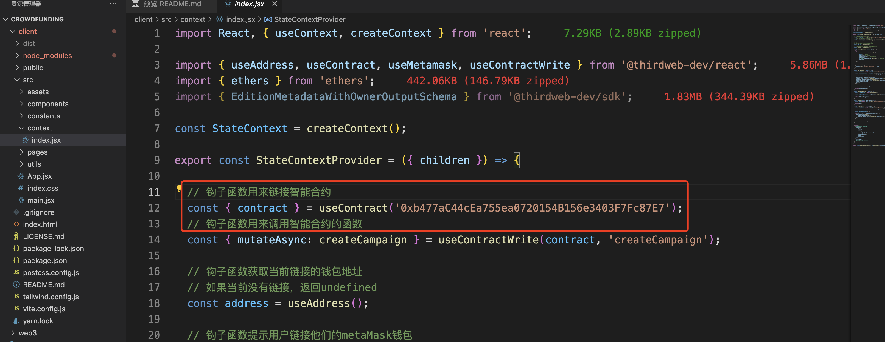

# 本项目是仿Kickstarter众筹平台
## 1. 项目列表
- client 前端
- web3 合约部分

## 2. 技术栈
- client
  - React
  - vite 打包编译
  - tailwindCss
- web3
  - solidity 0.8.9版本
## 3. 框架平台
- hardhat框架
- thirdweb 合约框架平台（合约发布）
- netlify 发布平台
- 测试网Sepolia
## 4.启动
- web3
  - npm install 安装依赖
  - npm run deploy 发布部署
- client
  - npm install 安装依赖
  - npm run dev 项目启动
## 5.注意
  1. web3项目部署成功，可以在 thirdweb平台看到成功部署的合约，或者去测试网Sepolia去看合约hash
  2. 将合约Hash复制到client中的context文件中
   
     

